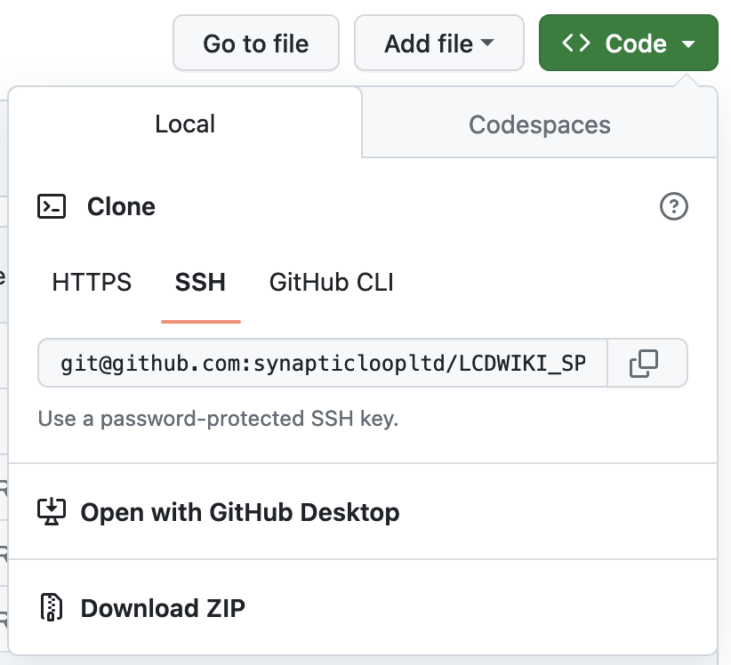

# LCDWIKI_SPI Library


## Download And Installation

Click on the `<> Code` button (top right of the screen), and then select `Download ZIP`



Unzip the library and move the newly unzipped folder folder into your `Arduino/libraries/` directory

Restart the Arduino IDE

## Usage
You will need to include the library in your sketch project, at the top of the file:

```
#include <LCDWIKI_SPI.h>    //Hardware-specific library
```

You may also want to include the `LCDWIKI_GUI` library as well:

```
#include <LCDWIKI_GUI.h>    //Core graphics library
```


---

### Previous Library License README.txt

--- 

This is a library for the SPI lcd display.

This library support these lcd controller:

- ILI9325 
- ILI9328 
- ILI9341 
- HX8357D 
- HX8347G 
- HX8347I 
- ILI9486 
- ST7735S 
- SSD1283A

Check out the file of LCDWIKI SPI lib Requirements for our tutorials and wiring diagrams.

These displays use spi bus to communicate, 5 pins are required to interface (MISO is no need).

Basic functionally of this library was origianlly based on the demo-code of Adafruit GFX lib and Adafruit SPITFT lib.  

MIT license, all text above must be included in any redistribution

To download. click the DOWNLOADS button in the top right corner, rename the uncompressed folder `LCDWIKI_SPI`. Check that the `LCDWIKI_SPI` folder contains `LCDWIKI_SPI.cpp` and `LCDWIKI_SPI.h`

Place the `LCDWIKI_SPI` library folder your `<arduinosketchfolder>/libraries/` folder. You may need to create the libraries subfolder if its your first library. Restart the IDE

Also requires the LCDWIKI_GUI library for Arduino. 
[https://github.com/lcdwiki/LCDWIKI_gui]()